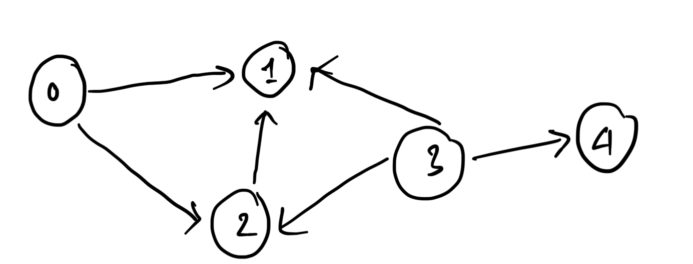

# Basic algorithm: 

## Sliding window: 
Strategy: 
1. Brute force (Time complexity: O(n^2)). Determine the condition of the answer. 
Example: [Longest Substring Without Repeating Characters](https://leetcode.com/problems/longest-substring-without-repeating-characters/description)
The condition is for every substring, count the number of characters from the beginning of the substring to the duplicated character. 
Example: [Longest Repeating Character Replacement](https://leetcode.com/problems/longest-repeating-character-replacement/description/)
The condition: for every substring, main a hashmap that map the character to the number of it occuring in the substring, Take the max of them "maxCount". Then: 
        Length - maxCount <= k
2. Optimize the brute force using sliding window: Determine the invalid condition to move the left pointer.
   
Template: 
* Shrinkable: 
    ```
    int i = 0, j = 0, ans = 0;
    for (; j < N; ++j) {
        // CODE: use A[j] to update state which might make the window invalid
        for (; invalid(); ++i) { // when invalid, keep shrinking the left edge until it's valid again
            // CODE: update state using A[i]
        }
        ans = max(ans, j - i + 1); // the window [i, j] is the maximum window we've found thus far
    }
    return ans;
```

* Non - shrinkable: 
    ```
    int i = 0, j = 0;
    for (; j < N; ++j) {
        // CODE: use A[j] to update state which might make the window invalid
        if (invalid()) { // Increment the left edge ONLY when the window is invalid. In this way, the window GROWs when it's valid, and SHIFTs when it's invalid
            // CODE: update state using A[i]
            ++i;
        }
        // after `++j` in the for loop, this window `[i, j)` of length `j - i` MIGHT be valid.
    }
    return j - i; // There must be a maximum window of size `j - i`.
```


# Graph: 
- Def: a type of data structure connecting vertices using egdes
- Directed or undirected. 
- Weighted or unweighted. 
- n vertices, m edges. 
## Graph storage: 
****


### Using adjacency matrix: 
```{c}
// Using adjacency matrix: 
class Graph{
    int nVertices; 
    vector<vector<int> >adjacencyMatrix; 
    public: 
    Graph(int vertices): nVertices(vertices), adjacencyMatrix(vertices, vector<int>(vertices,0)){}
    void addEdges(int startingNode, int endNode){
        this->adjacencyMatrix[startingNode][endNode] = 1; 
    }; 
    void printGraph(){
        for (int i = 0; i < nVertices; i++){
            cout << "The node " << i << " is connected to: "; 
            for (int j = 0; j < nVertices; j++){
                if (adjacencyMatrix[i][j] == 1) cout << j << " ";
            }
            cout << "\n";
        }
    }
}; 
```
### Using adjacency list: 

```{c}
class _Graph{
    int nVertices; 
    vector<vector<int> >adjacencyList; 
    public: 
    _Graph(int vertices): nVertices(vertices), adjacencyList(vertices){}
    void addEdges(int startingNode, int endNode){
        this->adjacencyList[startingNode].push_back(endNode); 
    }; 
    void printGraph(){
        for (int i = 0; i < nVertices; i++){
            cout << "The node " << i << " is connected to: "; 
            for (int j: adjacencyList[i]){
                cout << j << " ";
            }
            cout << "\n";
        }
    }
}; 

```


## 1. Depth first search: 

### 2D graph type problem: 
- Problems: 
  - [Number of Islands](https://leetcode.com/problems/number-of-islands/description/)
  - Max area of islands
  - Clone graph

- Initializing an n×m (rows × cols) vector<vector<bool>> with false values.

```
 std::vector<std::vector<bool>> visited(rows, std::vector<bool>(cols, false));
```


### Connected components: 
```


```


### Detecting cycles: 
1. In directed graph: 
```
#include <vector>
using namespace std;

bool dfs(int v, const vector<vector<int>>& graph, vector<bool>& visited, vector<bool>& recStack) {
    if (!visited[v]) {
        // Mark the current node as visited and add it to the recursion stack.
        visited[v] = true;
        recStack[v] = true;

        // Recur for all neighbors.
        for (int neighbor : graph[v]) {
            if (!visited[neighbor] && dfs(neighbor, graph, visited, recStack))
                return true;
            else if (recStack[neighbor])
                return true;
        }
    }
    // Remove the node from the recursion stack.
    recStack[v] = false;
    return false;
}

bool hasCycleDirected(const vector<vector<int>>& graph, int V) {
    vector<bool> visited(V, false);
    vector<bool> recStack(V, false);

    // Call the recursive helper function for all vertices.
    for (int i = 0; i < V; i++) {
        if (dfs(i, graph, visited, recStack))
            return true;
    }
    return false;
}

```

2. In undirected graph:
- Using DFS
```

bool dfsUndirected(int v, int parent, const vector<vector<int>>& graph, vector<bool>& visited) {
    visited[v] = true;

    for (int neighbor : graph[v]) {
        // If neighbor is not visited, recur on it.
        if (!visited[neighbor]) {
            if (dfsUndirected(neighbor, v, graph, visited))
                return true;
        }
        // If neighbor is visited and is not the parent, cycle exists.
        else if (neighbor != parent) {
            return true;
        }
    }
    return false;
}

bool hasCycleUndirected(const vector<vector<int>>& graph, int V) {
    vector<bool> visited(V, false);

    for (int i = 0; i < V; i++) {
        if (!visited[i]) {
            if (dfsUndirected(i, -1, graph, visited))
                return true;
        }
    }
    return false;
}

```
- Using [DSU](#union---find-also-called-disjoint-set-union-dsu)

##  2. Breadth-first search: 
- Implemented with a queue -> iterative, not recursive.
- Can be implemented using iterative approach, just more complex.
BFS from source s, with a adjacency list adj. 
```
void BFS(int s, vector<vector<int> >& adj){
    queue<int> q;
    vector<bool> visited (adj.size(), false);
    visited[s] = true;
    q.push(s);
    while (!q.empty()){
        q.pop();
        for (int a: adj[s]){
        if (visited[a]){
            q.push(a);
            visited[a] = true;
            }
        }
    }

}
```

### 2D graph type problem: 
- Walls and gates 

### Shortest path in undirected graph: [Word ladder](https://leetcode.com/problems/word-ladder/description/)

```
#include <iostream>
#include <vector>
#include <queue>
#include <unordered_set>

using namespace std;

vector<int> bfs_shortest_path(const vector<vector<int>>& graph, int start, int target) {
    queue<pair<int, vector<int>>> q; // (current node, path to this node)
    unordered_set<int> visited;
    
    q.push({start, {start}});
    visited.insert(start);
    
    while (!q.empty()) {
        int node = q.front().first;
        vector<int> path = q.front().second;
        q.pop();
        
        if (node == target) {
            return path; // Found the shortest path
        }
        
        for (int neighbor : graph[node]) {
            if (visited.find(neighbor) == visited.end()) {
                visited.insert(neighbor);
                vector<int> new_path = path;
                new_path.push_back(neighbor);
                q.push({neighbor, new_path});
            }
        }
    }
    
    return {}; // No path found
}

int main() {
    // Adjacency list for an undirected graph
    vector<vector<int>> graph = {
        {1, 2},       // Node 0 is connected to 1 and 2
        {0, 3},       // Node 1 is connected to 0 and 3
        {0, 3},       // Node 2 is connected to 0 and 3
        {1, 2, 4},    // Node 3 is connected to 1, 2, and 4
        {3}           // Node 4 is connected to 3
    };
    
    vector<int> path = bfs_shortest_path(graph, 0, 4);
    
    if (!path.empty()) {
        cout << "Shortest path: ";
        for (int node : path) {
            cout << node << " ";
        }
        cout << endl;
    } else {
        cout << "No path found." << endl;
    }

    return 0;
}

```


## Dijkstra's Algorithm: 
* Find shortest path in weighted graph.
* Dijkstra's algorithm is a greedy algorithm used to find the shortest path from a single source node to all other nodes in a weighted graph with non-negative edge weights

### Key Steps of Dijkstra's Algorithm
1. Initialization:

    Set the distance to the source node as 0.

    Set the distance to all other nodes as ∞ (infinity).

    Mark all nodes as unvisited.

2. Main Loop:

    Select the unvisited node with the smallest tentative distance (call it the current node).

    For each neighbor of the current node, calculate the tentative distance through the current node:

        tentative distance = distance[current node] + weight(current node, neighbor)
    If the tentative distance is smaller than the previously recorded distance, update the distance.

    Mark the current node as visited.

3. Termination:

    The algorithm terminates when all nodes have been visited or when the smallest tentative distance among the unvisited nodes is ∞ (meaning the remaining nodes are unreachable).

### Why it works: 

Proof of Correctness
    To formally prove that Dijkstra's algorithm works, we can use mathematical induction:

    Base Case:
      * At the start, the source node S has a distance of 0, which is correct.

    Inductive Step:
       * Assume that the distances to the first k visited nodes are correct.

       * When the algorithm selects the (k+1)-th node (the unvisited node with the smallest tentative distance), its distance must be correct because any path to this node must pass through one of the already visited nodes.

       * Since the algorithm always chooses the smallest tentative distance, no shorter path can exist.

    Conclusion:
      * By induction, the distances to all nodes are correct when the algorithm terminates.


### Optimize using priority queue: 
* At each step, Dijkstra's algorithm needs to find the unvisited node with the smallest tentative distance. 
* PQ allows us to look through this without having to traverse through every nodes. 

Code: 
```


```


## 3. Topological sorting: 
 If the graph doesn't have any cycles, then it 


# Union - Find (also called Disjoint Set Union, DSU): 
- Used to manage a partition of a set into disjoint (non-overlapping) subsets.
- Supports two main operations:
  - Union — Merge two subsets into one.
  - Find: Find the root node. 
- Usually used in: 
  - Connected components detection in undirected graph: [Redundant Connection
](https://leetcode.com/problems/redundant-connection/description/)
  - Dynamic connectivity problems
  - Graph algorithms, like Kruskal's algorithm (Minimum Spanning Tree).
## 2 heuristics: 
- Path Compression: flatten the structure of the tree to make find operation more efficient
-  Rank heuristic: If two elements are at different sets, merge the smaller set to the larger set. (implemented by rank). 
### Union: (implemented below)
### Find: (implemented below)

```
class unionFind{
    vector<int> parent; 
    vector<int> rank;

    public: 
    unionFind(int n){
        this->parent.resize(n);
        this->rank.resize(n);
        for (int i = 0; i < n; i++){
            parent[i] = i; 
            rank[i] = 1;
        }
    }

    int find(int x){
        if (this->parent[x] != x) parent[x] = find(parent[x]);
        return parent[x]; 
    }

    void join(int x, int y){
        int rootX = this->find(x); 
        int rootY = this->find(y); 
        
        if (rootX != rootY){
            if (this->rank[rootX] < this->rank[rootY]) this->parent[rootX] = this->parent[rootY];
            else if (this->rank[rootX] > this->rank[rootY]) this->parent[rootY] = this->parent[rootX];
            else {
                this->parent[rootX] = this->parent[rootY];
                this->rank[rootY]++; 
            }
        }
    }
}; 

```
## References: 
[Medium](https://yuminlee2.medium.com/union-find-algorithm-ffa9cd7d2dba#5b04)


# Bit manipulation 