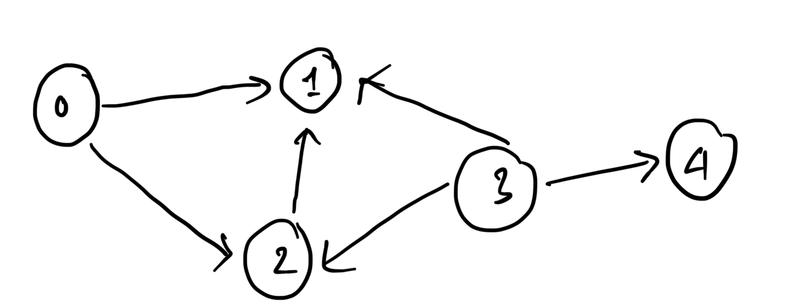

# Graph: 
- Def: a type of data structure connecting vertices using egdes
- Directed or undirected. 
- Weighted or unweighted. 
- n vertices, m edges. 
## Graph storage: 
****


### Using adjacency matrix: 
```{c}
// Using adjacency matrix: 
class Graph{
    int nVertices; 
    vector<vector<int> >adjacencyMatrix; 
    public: 
    Graph(int vertices): nVertices(vertices), adjacencyMatrix(vertices, vector<int>(vertices,0)){}
    void addEdges(int startingNode, int endNode){
        this->adjacencyMatrix[startingNode][endNode] = 1; 
    }; 
    void printGraph(){
        for (int i = 0; i < nVertices; i++){
            cout << "The node " << i << " is connected to: "; 
            for (int j = 0; j < nVertices; j++){
                if (adjacencyMatrix[i][j] == 1) cout << j << " ";
            }
            cout << "\n";
        }
    }
}; 
```
### Using adjacency list: 

```{c}
class _Graph{
    int nVertices; 
    vector<vector<int> >adjacencyList; 
    public: 
    _Graph(int vertices): nVertices(vertices), adjacencyList(vertices){}
    void addEdges(int startingNode, int endNode){
        this->adjacencyList[startingNode].push_back(endNode); 
    }; 
    void printGraph(){
        for (int i = 0; i < nVertices; i++){
            cout << "The node " << i << " is connected to: "; 
            for (int j: adjacencyList[i]){
                cout << j << " ";
            }
            cout << "\n";
        }
    }
}; 

```


## 1. Depth first search: 

### Connected components: 
```


```


### Detecting cycles: 
```
#include <vector>
using namespace std;

bool dfs(int v, const vector<vector<int>>& graph, vector<bool>& visited, vector<bool>& recStack) {
    if (!visited[v]) {
        // Mark the current node as visited and add it to the recursion stack.
        visited[v] = true;
        recStack[v] = true;

        // Recur for all neighbors.
        for (int neighbor : graph[v]) {
            if (!visited[neighbor] && dfs(neighbor, graph, visited, recStack))
                return true;
            else if (recStack[neighbor])
                return true;
        }
    }
    // Remove the node from the recursion stack.
    recStack[v] = false;
    return false;
}

bool hasCycleDirected(const vector<vector<int>>& graph, int V) {
    vector<bool> visited(V, false);
    vector<bool> recStack(V, false);

    // Call the recursive helper function for all vertices.
    for (int i = 0; i < V; i++) {
        if (dfs(i, graph, visited, recStack))
            return true;
    }
    return false;
}

```


##  2. Breadth-first search: 

BFS from source s, with a adjacency list adj. 
```
void BFS(int s, vector<vector<int> >& adj){
    queue<int> q;
    vector<bool> visited (adj.size(), false);
    visited[s] = true;
    q.push(s);
    while (!q.empty()){
        q.pop();
        for (int a: adj[s]){
        if (visited[a]){
            q.push(a);
            visited[a] = true;
            }
        }
    }

}
```
# 2. Initializing an n×m (rows × cols) vector<vector<bool>> with false values.

```
 std::vector<std::vector<bool>> visited(rows, std::vector<bool>(cols, false));
 ```


 # 3. Topological sorting: 
 If the graph doesn't have any cycles, then it 


# Union - Find: 


```
class unionFind{
    vector<int> parent; 
    vector<int> rank;

    public: 
    unionFind(int n){
        this->parent.resize(n);
        this->rank.resize(n);
        for (int i = 0; i < n; i++){
            parent[i] = i; 
            rank[i] = 1;
        }
    }

    int find(int x){
        if (this->parent[x] != x) parent[x] = find(parent[x]);
        return parent[x]; 
    }

    void join(int x, int y){
        int rootX = this->find(x); 
        int rootY = this->find(y); 
        
        if (rootX != rootY){
            if (this->rank[rootX] < this->rank[rootY]) this->parent[rootX] = this->parent[rootY];
            else if (this->rank[rootX] > this->rank[rootY]) this->parent[rootY] = this->parent[rootX];
            else {
                this->parent[rootX] = this->parent[rootY];
                this->rank[rootY]++; 
            }
        }
    }
}; 

```
